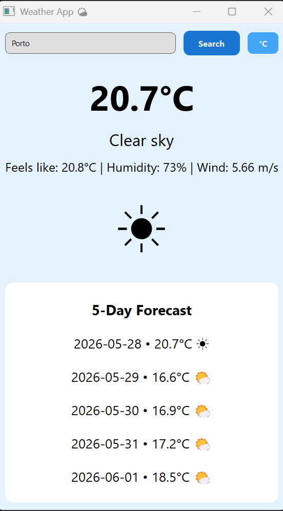

# Weather-App
Desktop weather app with 5-day forecast and day/night mode, built with Python and PyQt5.

# 🌤️ Weather App

A desktop weather application built with Python and PyQt5 that displays real-time weather data and a 5-day forecast for any city in the world.

## 📸 Preview



## 🚀 Features

- Real-time weather data via OpenWeatherMap API
- 5-day forecast
- Day/night mode — background changes automatically based on sunrise/sunset
- Toggle between Celsius and Fahrenheit
- Weather emojis based on conditions
- Auto-refresh every 10 minutes
- Handles errors gracefully (city not found, no internet, timeout)

## 🛠️ Built With

- **Python 3**
- **PyQt5** — GUI framework
- **Requests** — HTTP API calls
- **OpenWeatherMap API** — weather data

## ▶️ How to Run

1. Clone the repository:
   ```bash
   git clone https://github.com/VelosoMiguel/weather-app.git
   cd weather-app
   ```

2. Install dependencies:
   ```bash
   pip install PyQt5 requests
   ```

3. Get a free API key at [openweathermap.org](https://openweathermap.org/api)

4. Set your API key as an environment variable:
   ```bash
   # Mac/Linux
   export OPENWEATHER_API_KEY="your_api_key_here"

   # Windows
   set OPENWEATHER_API_KEY=your_api_key_here
   ```

5. Run the app:
   ```bash
   python Weather_App.py
   ```

## 🔮 Future Improvements

- [ ] Search history
- [ ] Favourite cities
- [ ] Hourly forecast chart
- [ ] System tray integration

## 👤 Author

**Miguel Veloso**  
[GitHub](https://github.com/VelosoMiguel) · [LinkedIn](https://www.linkedin.com/in/miguel-veloso-91355b372/)
